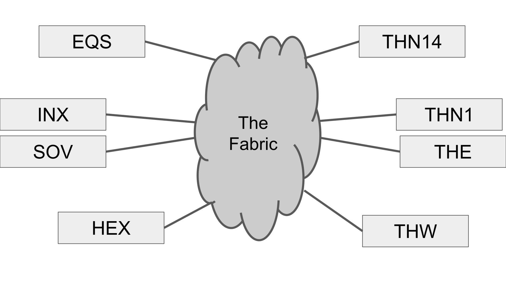
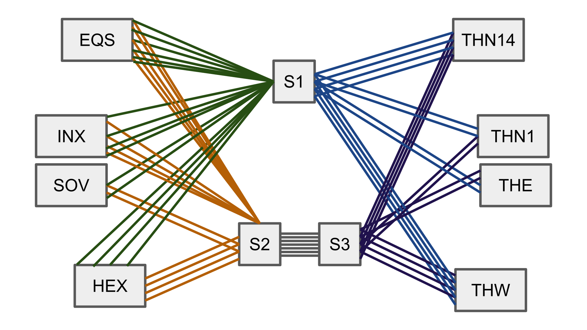
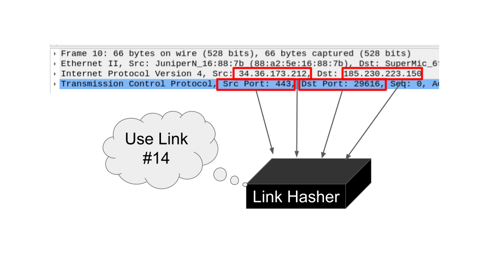
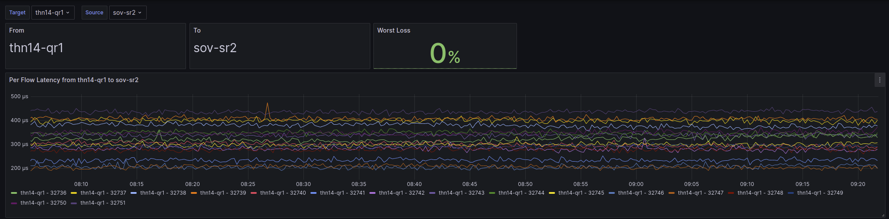

ixp-xping
===

ixp-xping is a prometheus exporter that aims to detect packet loss/latency that is impacting a limited number of network flows on an internet exchange (However it could be used outside of those environments as well).

The stand out feature from ixp-ping to other solutions is that it supports monitoring more than one IXP switch per system, meaning a IX deployment can have all of the switches tests with just one machine with the correct network card types to accommodate them all (Though the machine cannot monitor the inner sites traffic quality since the machine cannot monitor itself!)

## Theory

Traditionally you would monitor things using ICMP between each host, forming a mesh.



However this overlooks how a lot of modern backbones are not a single set of physical links, but aggregations of links to build up larger capacities than current possible single port link speeds.



The way that routers in the path decide what link to send traffic down when they have more than one option is typically done though hashing, In where the Source/Destination Port, and the Source/Destination IP address and the IP protocol (The 5 tuple) are converted into a single number that is then used to select a link to forward the packet on to.



ixp-xping works by creating a number of different UDP flows (aka, a UDP port) to every single peer xping instance and testing latency and loss over each one. Using the fact that modern day IP transport works with ECMP or other forms of packet hashing, this can correctly detect faulty link aggregation members, or overloaded links inside a link aggregation group.

## Example Output

The program outputs data in the form of a prometheus exporter:

```
# HELP xping_peer_latency_per_flow aaa
# TYPE xping_peer_latency_per_flow gauge
xping_peer_latency_per_flow{peer="192.168.122.49",port="32736"} 844
…
xping_peer_latency_per_flow{peer="192.168.122.49",port="32751"} 521
xping_peer_latency_per_flow{peer="192.168.122.50",port="32736"} 431
…
xping_peer_latency_per_flow{peer="192.168.122.50",port="32751"} 338
```

That can then be used to create latency and loss graphs that take into account each link the data may be hashed on to between the two peers.



## Config

The program is configured by a YAML file located in `/etc/ixp-xping.yaml`, however this file path can be changed with the `-cfg.path /foo/bar.yaml` option

Inside the file should be a file like:

```yaml
listenhost: 0.0.0.0
listenportstart: 32736
pollratems: 250
peers:
- 192.0.2.43
- 192.0.2.22
- 192.0.2.73
peersnames:
  192.0.2.73: thn14-cr1
  192.0.2.22: the-sr2
  192.0.2.43: sov-sr2
allowedcidrs:
- 192.0.0.0/22
prometheusport: 9150
```

In addition, there is an automatic configuration mode that reads an internal LONAP style format. By default on start xping will look for `/usr/local/etc/lonap_mon_hosts.json` in the following format:

```json
{
    "eqs-mon1": {
      "eqs-cr1": {
        "address": "192.0.2.94",
        "device": "ens2",
        "netmask": "255.255.252.0"
      },
      "eqs-qr1": {
        "address": "192.0.2.93",
        "device": "ens2d1",
        "netmask": "255.255.252.0"
      }
    },
    "hex-mon1": {
      "hex-cr1": {
        "address": "192.0.2.32",
        "device": "ens2",
        "netmask": "255.255.252.0"
      },
      "hex-qr1": {
        "address": "192.0.2.36",
        "device": "ens2d1",
        "netmask": "255.255.252.0"
      },
      "hex-sr1": {
        "address": "192.0.2.31",
        "device": "eno50",
        "netmask": "255.255.252.0"
      }
    }
}
```

and proceed to automatically add the allowedcidr's,peers, and peersnames.


### YAML configuration sections

**listenhost**

This is the IP address to bind on to listen to, It is recommended to bind on 0.0.0.0

**listenportstart**

This is the port number to start binding on, this number must be the same amongst all peers

**pollratems**

The number of milliseconds to wait before sending each probe

**peers**

A list of IP addresses that are also running xping, These peer lists are allowed to be different between peers, but care should be taken to ensure that the `allowedcidrs` section allows those peers to use the node.

**peersnames**

This optionally renames IP addresses to host names, this makes it a lot easier on systems like AlertManager or Grafana to display the true device name rather than an opaque IP address.

**allowedcidrs**

This spesifies what IP CIDRs the local xping instance is allowed to reply to pings from. If a packet arrives that is not on the allowedcidrs list then it will be dropped.

**prometheusport**

What TCP port to listen on for HTTP requests for the prometheus endpoint `/metrics`

## Alerting

You could set up automated alerting for when packet loss is detected between two peers on the exchange by using [AlertManager](https://prometheus.io/docs/alerting/latest/alertmanager/).

Here is an example AlertManager rule that would alert for more than 2% packet loss on the exchange for more than 300 seconds:

```
  - alert: xpingPacketLossOnFlow
    expr: xping_peer_loss_per_flow > 0.02
    for: 5m
    annotations:
      summary: Loss between two endpoints detected
      description: Loss detected between {{$labels.local}} (Port {{$.labels.port}}) and {{$labels.peer}}
```

## Building

To build the deb file that you can then install onto a machine you can use the debuild ecosystem.

If you have alraedy built the binary, you should be able to just run:

```
debuild -b -uc -us
```

A debian file should then be produced that can be installed to each machine. (in the directory above).

If you are building this "fresh" you will need to setup go, debuild, and others. Here is a rough set
of commands you will need to run.

```
apt install devscripts lintian dh-golang build-essential

wget https://go.dev/dl/go1.22.4.linux-amd64.tar.gz

rm -rf /usr/local/go && tar -C /usr/local -xzf go1.22.4.linux-amd64.tar.gz

export PATH=$PATH:/usr/local/go/bin

make

debuild -b -uc -us
```

## Authorship / Commission

This project was commissioned by the LONdon Access Point (LONAP) internet exchange 
